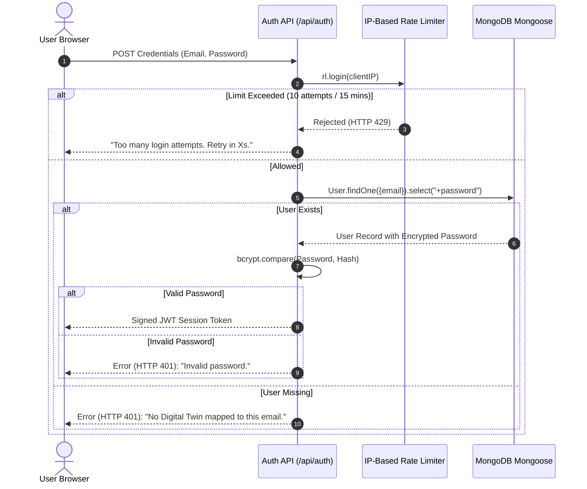
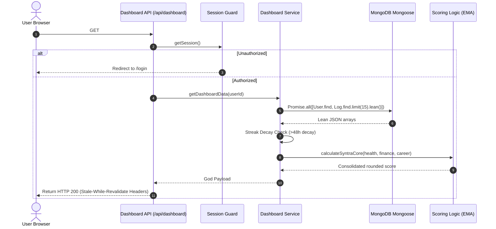
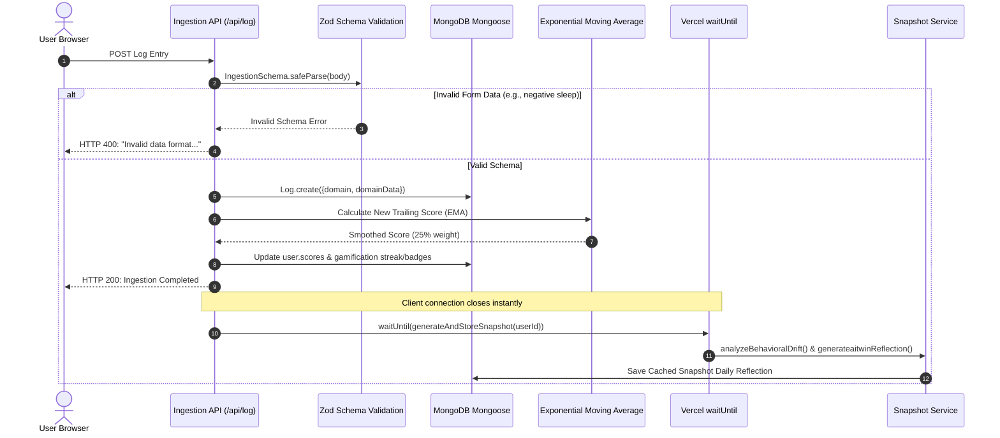
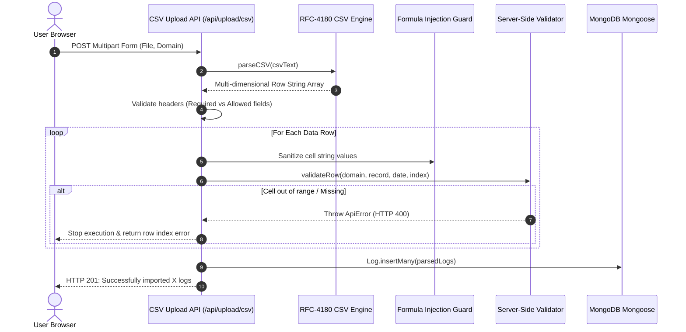
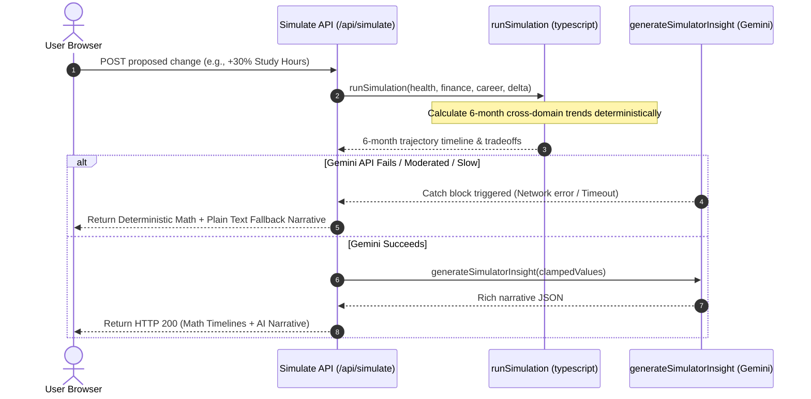
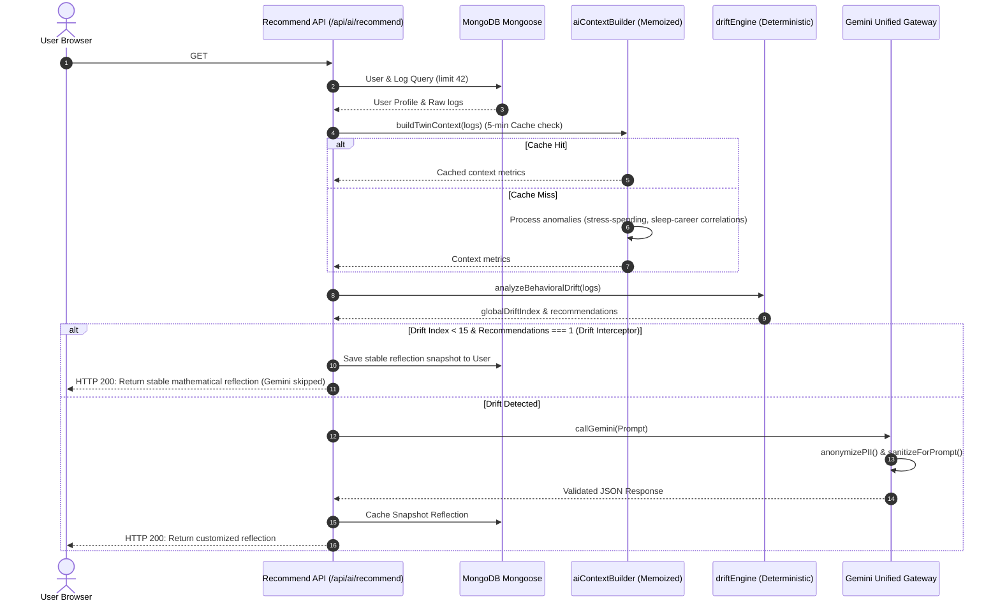

# Syntra Digital Twin: Comprehensive Architecture & Control Flow Guide

This document provides a detailed breakdown of Syntra's multi-layered architecture, mapping every user-facing page to its underlying control flows, API boundaries, and mathematical engines. It details how the system guarantees security, prevents LLM hallucinations, and enforces robust operational fallbacks at each tier.

---

## 1. Architectural Overview & Control Flow Hierarchy

Syntra is designed around a **"Deterministic Core, Adaptive Shell"** philosophy. Instead of allowing the AI model to perform numerical calculations or directly query the database, a strict series of safety, rate-limiting, and mathematical pre-processing layers shield both the database and the generative API.

```mermaid
graph TD
    %% Styling
    classDef client fill:#e0f2fe,stroke:#0369a1,stroke-width:2px;
    classDef guard fill:#fee2e2,stroke:#b91c1c,stroke-width:2px;
    classDef server fill:#fef9c3,stroke:#a16207,stroke-width:2px;
    classDef math fill:#dcfce7,stroke:#15803d,stroke-width:2px;
    classDef ai fill:#f3e8ff,stroke:#6b21a8,stroke-width:2px;
    classDef db fill:#f3f4f6,stroke:#374151,stroke-width:2px;

    %% Nodes
    A[Client UI - Next.js / Tailwind CSS]:::client
    B[API Route / Session Guard - getServerSession]:::guard
    C[Rate Limiting - Sliding Window Store]:::guard
    D[apiHandler Wrapper - Strict Error Sanitizer]:::guard
    E[Zod Ingestion Schema - Structural Verification]:::guard
    F[Service Layer - getDashboardData / snapshotService]:::server
    G[Deterministic Math - EMA Scoring / driftEngine / financeMath]:::math
    H[AI Context Builder - Memoized Data Aggregation]:::math
    I[Prompt Gateway - anonymizePII / sanitizeForPrompt]:::ai
    J[Google Gemini 2.5 Flash API]:::ai
    K[Gemini Schema Validator - aitwinReflectionSchema]:::ai
    L[Vercel waitUntil - Non-blocking Background Executor]:::server
    M[MongoDB Mongoose Database]:::db

    %% Connections
    A -->|1. HTTPS Request| B
    B -->|2. Check Authentication| C
    C -->|3. sliding-window check| D
    D -->|4. Catch errors & mask stack trace| E
    E -->|5. Verify types & range clamp| F
    F -->|6. Orchestrate execution| G
    G -->|7. Calculate stable indicators| H
    H -->|8. Fetch memoized analytical biometrics| I
    I -->|9. Strip PII / escape delimiters| J
    J -->|10. Generate JSON content| K
    K -->|11. Structurally validate response schema| L
    L -->|12. Write to cached DB snapshot| M
```



---

## 2. Page Features & Control Flow Deep Dive

Below is an analysis of each page in the Syntra platform, tracking the journey of data through the system and highlighting security and fallback systems at every step.

---

### A. Identity & Access Management: `/login` & `/signup`
These pages act as the front gate, securing the user's personal biometrics and establishing session contexts.



#### Security & Robustness Highlights:
*   **Brute-Force Rate Limiting:** The `rl.login` handler reads `x-forwarded-for` and `x-real-ip` headers to check the client's IP, limiting login attempts to **10 per 15 minutes**.
*   **Encrypted Passwords:** Passwords are hashed using standard `bcrypt` cycles. The Mongoose schema marks `password: { select: false }`, ensuring that standard queries for dashboards or logs never accidentally return password hashes in server memory or response payloads.
*   **Regex Integrity Checks:** On signup, `SignupSchema` enforces password complexity: a minimum of 8 characters, at least one uppercase letter, one number, and one special character.

---

### B. Life-Logger Dashboard: `/dashboard` (Twin OS)
The landing dashboard aggregates daily metrics across Health, Finance, and Career, presenting a unified "Syntra Core" score and calculating physiological vs. chronological age divergence.



#### Security & Robustness Highlights:
*   **Stale Streak Decay:** The server evaluates the timestamp of the last logged day (`lastLogDate`). If more than **48 hours** have elapsed, it decays the streak to zero and writes it back to the database. This prevents users from fabricating high streaks through client-side manipulation.
*   **Memory Optimization:** The database query uses Mongoose `.lean()`. This strips away internal Mongoose methods, change tracking, and getters, reducing heap allocations and ensuring fast JSON serialization.
*   **Cache-Control Header Security:** Returns `Cache-Control: private, s-maxage=300, stale-while-revalidate=600`, preventing CDNs and public intermediate proxies from caching user biometrics while allowing browser-side caching with smooth background updates.

---

### C. Manual Log Calibrator: `/ingestion`
Allows manual input of daily metrics (e.g., sleep hours, workout minutes, stress level, discretionary spend, study hours).



#### Security & Robustness Highlights:
*   **Structural Schema Guards:** Zod's `discriminatedUnion` validates each payload based on its `domain` key, rejecting unrecognized parameters and ensuring type correctness before DB writes.
*   **Exponential Moving Average (EMA):** Prevents sharp, erratic jumps in scores due to single-day anomalies. A smoothing factor of **0.25** ensures that a single missed workout doesn't tank the health score, providing stable trend tracking:
    $$\text{Score}_{\text{new}} = \text{Round}\left(\text{Score}_{\text{old}} \times 0.75 + \text{Score}_{\text{logged}} \times 0.25\right)$$
*   **Vercel `waitUntil` Non-Blocking Optimization:** Calling Gemini AI during an ingestion submit would introduce **1–3 seconds of latency**. Syntra writes the logs, recalculates the math, and returns a success response to the user immediately. It delegates the slow Gemini reflection generation to Vercel's `waitUntil` background execution loop.

---

### D. Bulk Log Importer: CSV Ingest Dashboard
Allows users to upload historical logs in bulk.



#### Security & Robustness Highlights:
*   **RFC-4180 Compliant CSV Parser:** The custom parser parses escaped double quotes (`""`), cell-enclosed commas, and newlines safely, preventing parser-level crashes or stack overflows.
*   **CSV Formula Injection Shield:** A critical security vulnerability in spreadsheets is formula injection, where strings beginning with `=, +, -, @` trigger arbitrary commands on a viewer's local machine. Syntra's parser automatically intercepts these prefixes and prepends a safe single quote `'` before database persistence.
    ```typescript
    record[standardHeader] = typeof val === "string" && /^[=\+\-\@]/.test(val) ? `'${val}` : val;
    ```
*   **Atomic Database Operations:** Uses `Log.insertMany(...)` to commit all uploaded records in a single database transaction, preventing partial ingestion states if the connection drops.

---

### E. Predictive Life Simulator: `/simulator`
Provides interactive sliders modeling the future cross-domain consequences of changes in habits.



#### Security & Robustness Highlights:
*   **Deterministic Math First (Hallucination Proofing):** The core simulation values (timeline indexes, tradeoff variables, risk assessments) are computed **exclusively** inside a pure, deterministic TypeScript module (`simulator.ts`).
    *   *Why this matters:* Large Language Models are notoriously poor at arithmetic and multi-step equations. If the AI were responsible for calculating scores, it would often hallucinate incorrect projections. Syntra solves this by performing the math in TypeScript and providing only the finalized figures to Gemini for linguistic contextualization.
*   **Math Input Clamp:** To prevent division by zero, massive values, or infinity issues, the simulator clamps input variables to a safe range before calculations:
    ```typescript
    const clampedChange = Math.max(-0.9, Math.min(0.9, scenario.percentageChange));
    ```
*   **AI Try-Catch Narrative Fallback:** If the Gemini API experiences an error, rather than failing, the catch block intercepts it and synthesizes a mathematically coherent fallback narrative:
    ```typescript
    catch (e) {
      aiAnalysis = {
        scenarioTitle: `${scenario.domain} shift projection`,
        primaryOutcome: `Projecting a ${Math.round(percentageChange * 100)}% shift in ${scenario.domain}.`,
        tradeOffs: [],
        timelineProjection: [],
        riskLevel: simulationResult.riskAssessment.includes("High") ? "high" : "medium",
        recommendedPath: "Monitor all domains as changes take effect.",
        confidence: 0,
      };
    }
    ```

---

### F. Twin Insights Hub: `/insights`
Presents cross-domain predictions, personalized biometrical correlations, and daily challenges.



#### Security & Robustness Highlights:
*   **In-Memory Context Memoization:** The AI context builder calculations are cached for **5 minutes** via a custom async request coalescing wrapper (`memoize.ts`). If multiple requests hit `/insights` concurrently, they share the same pending promise instead of triggering multiple database lookups.
*   **Drift Interceptor (Gemini Cost Optimization & Accuracy Safeguard):** If a user's habits are stable, their behavioral drift index will be low (<15). In this scenario, the `snapshotService` **bypasses Gemini completely** and generates a structured stable response locally. This saves significant token usage and avoids API costs when there is no critical behavior to report.
*   **Structured Output Schema Validation:** Validates all LLM outputs using Zod schemas (`aitwinReflectionSchema`) before DB writes or client responses. If Gemini returns invalid JSON, the parser catches the error and serves a clean fallback template.

---

## 3. Comprehensive Security, Safety, & Fallback Matrix

The table below catalogs every potential failure state or security vulnerability across Syntra's control layers, specifying how the system protects user data.

| Layer | Risk / Threat | Technical Defense Mechanism | Operational Fallback System |
| :--- | :--- | :--- | :--- |
| **Network & Guard** | Denial of Service (DoS) / Brute-Force | `checkRateLimit` (sliding window memory store) clamps routes to safe thresholds. | Rejects excess requests with HTTP 429 and standard `Retry-After` headers. |
| **Authentication** | Password Leakage / timing attacks | `bcrypt.compare` execution; schema blocks returning password field unless explicitly requested (`select: "+password"`). | Returns a generic "No Digital Twin mapped to this email" message to prevent account harvesting. |
| **Zod Ingestion** | Database Contamination / Type Injection | Enforces strict schemas (`DailyLogSchema`, `IngestionSchema`). Blocks strings in numeric inputs and handles date formatting. | Throws standard validation errors immediately without querying the database, preventing DB overhead. |
| **CSV Parser** | Macro Executions / Formula Injections | CSV Injection protection: strips `=, +, -, @` prefixes from fields and replaces them with an escaped single quote `'`. | Sanitizes raw fields on a row-by-row basis and throws line-specific syntax errors if formatting is invalid. |
| **Context Builder** | Memory Bloat / Token Overhead | Explicitly truncates text fields (e.g., `courseName` capped at 60 chars, `dailyNote` at 120 chars) to prevent massive payloads. | Reverts to nominal averages and static historical baselines if inputs are empty or logs are missing. |
| **Prompt Security** | Prompt Injection / heading breakout | `sanitizeForPrompt` flattens newlines, strips divider lookalikes (`[━─═\-=*#]{3,}`), and normalizes exotic quotes. | Clamps string variables to **200 characters** to prevent prompt injection attempts. |
| **Data Privacy** | Privacy Leak / PII Leakage | `anonymizePII` deep-traverses JSON payloads, matching sensitive keys (e.g., `email`, `name`, `pan`, `aadhaar`) and replacing them with `[REDACTED]`. | Prevents sensitive personal details from being sent to external third-party generative endpoints. |
| **Scoring Engine** | Out-of-bounds metrics (e.g., negative sleep) | Dynamic score capping inside `scoring.ts` forces values to remain strictly between **0 and 100**. | Enforces deterministic calculations, preventing LLM metric hallucinations. |
| **AI Gateway** | Unparsed JSON / Invalid output formats | Unified `callGemini` helper removes markdown code blocks, normalizes formatting, and parses JSON. | If parsing fails, the gateway gracefully treats the response as plain text and returns it. |
| **API Endpoints** | Internal Stack / Directory Leakage | Higher-order `apiHandler` interceptor catches all unexpected runtime errors. | Logs diagnostic details internally while serving a generic safety message: *"Twin architecture encountered an anomaly. Safe mode engaged."* |

---

## 4. Summary of Data Ingestion and Processing Flow

To track how a user's metric updates both the database and the predictive AI model, we can trace a single `health` log entry:

1.  **Ingestion:** The user submits a daily sleep log of `5.5 hours` at `/ingestion`.
2.  **API Validation:** The post request hits `src/app/api/log/route.ts`. The schema parser checks that the value is a number between `0` and `24`.
3.  **Database Commit:** The log is saved as a document in the `logs` collection with a reference to `userId`.
4.  **Math Integration (EMA):** The system updates the user's trailing health score from `70` to `66` using Exponential Moving Average smoothing.
5.  **Instantly Returning:** The API saves the updated scores and returns an HTTP 200 response to the client in under 100ms.
6.  **Background Processing (`waitUntil`):** The system triggers `generateAndStoreSnapshot` asynchronously in the background.
7.  **Drift & Divergence Evaluation:** The `driftEngine` runs a standard deviation check on the user's sleep metrics. It detects a significant sleep deficit trend.
8.  **AI Invocation:** Because the user has active drift, `callGemini` is invoked.
9.  **Context Construction:** The system queries the last 42 logs, calculates averages, identifies sleep-career correlations, strips PII, and sanitizes prompt inputs.
10. **JSON Persistence:** Gemini processes the context and returns structured reflection JSON containing a prediction, explainability bullets, a daily challenge, and custom goals. The system validates the output schema and caches it in the user's document for instant subsequent dashboard loads.
